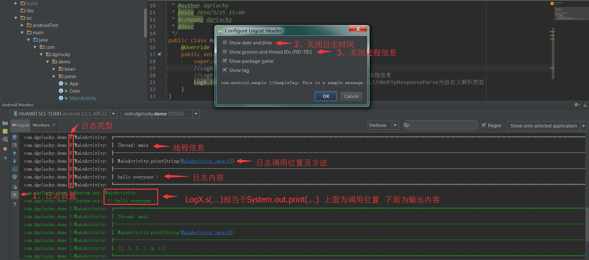
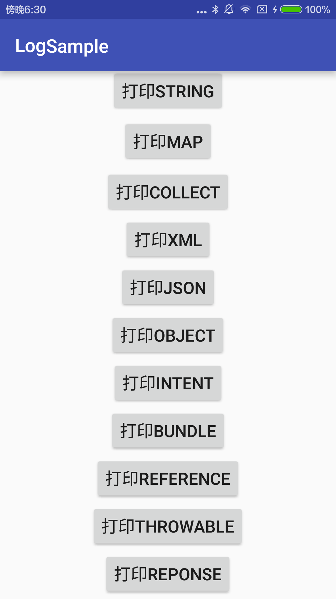
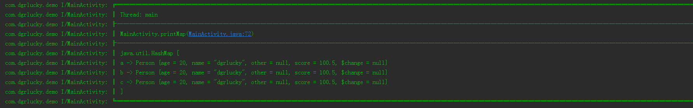
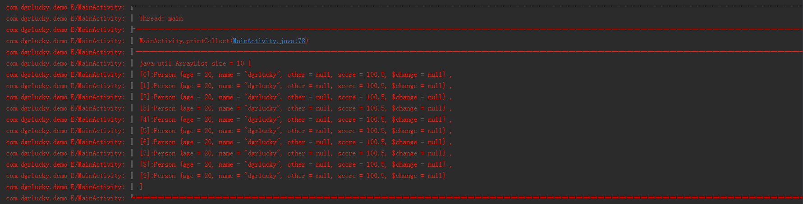
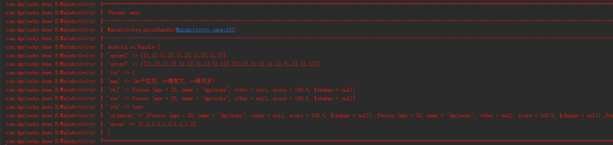
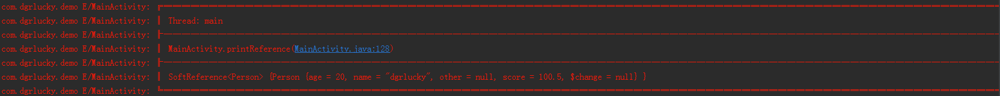

#  LogX Manual #
>Easier to output any log with everyone

### Features
>* 支持直接打印任意数据,如List、Set、Map、数组等
>* 全局配置不同类型log输出，支持Stringformat
>* 准确显示调用方法、行，快速定位调用位置
>* 支持android系统对象Intent、Bundle等
>* 可实现Parser接口自定解析对象
>>*有想法欢迎提出


#是否还在担心在哪查看错误信息？看完下面的介绍你以后都不用愁

##### 设置及建议

##### 初始化设置

##### 打印类型说明

##### 打印String

##### 打印Map

##### 打印Collect

##### 打印Xml

##### 打印Json

##### 打印Object

##### 打印Intent

##### 打印Bundle

##### 打印Reference

##### 打印Throwable

##### 打印Reponse（需自定义添加）


## Tips
>* 想懒？
>* 1.你可以直接LogX.任意类型(任意对象);
>* 2.你现在可要直接打印Android常用类型。
>* 3.自定义解析类型，你可以不用愁！直接打印网络请求内容，格式美观


### Options
>* 使用前请在继承Application类下初始化。
>* LogX.init(BuildConfig.DEBUG);  BuildConfig.DEBUG的值自动为true,发布打包时自动变为false。
>* 根据自己喜好自定义打印信息

## Usage
```
1.根目录:logx.jar  添加到libs依赖方可使用
2.导入第三方库添加依赖，还可以自定义
3.在Maven Central搜索“logx”选择'compile 'com.github.dgrlucky:logx:1.0.0'
```

## About
* Blog: [dgrlucky.github.io](http://dgrlucky.github.io/) (建设中)
* Email: [dgrlucky@163.com](http://mail.qq.com/cgi-bin/qm_share?t=qm_mailme&email=dgrlucky@163.com)

### Thanks
thanks to 
>* [orhanobut/logger](https://github.com/orhanobut/logger)
>* [pengwei1024/LogUtils](https://github.com/pengwei1024/LogUtils)


### License
<pre>
Copyright 2015 dgrlucky

Licensed under the Apache License, Version 2.0 (the "License");
you may not use this file except in compliance with the License.
You may obtain a copy of the License at

   http://www.apache.org/licenses/LICENSE-2.0

Unless required by applicable law or agreed to in writing, software
distributed under the License is distributed on an "AS IS" BASIS,
WITHOUT WARRANTIES OR CONDITIONS OF ANY KIND, either express or implied.
See the License for the specific language governing permissions and
limitations under the License.
</pre>
